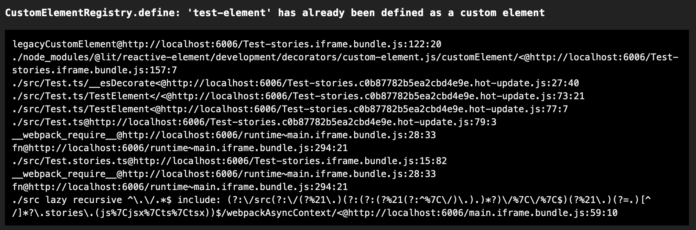

# Repro Steps for Hot Reloading

1. run `npm i` to install the dependencies
1. run `npm run storybook` to run the storybook
1. edit the render function in `Test.ts` and save to trigger a hot reload
1. it should hit an error from redefining the custom component
